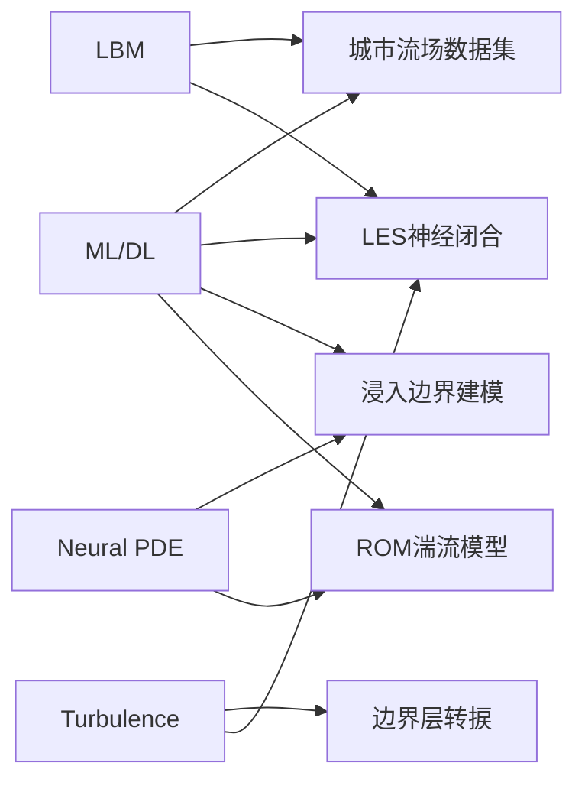

# arXiv 流体动力学论文速递 - 2026-03-18

> **搜索范围**: arXiv physics.flu-dyn (最近24小时)  
> **关键词**: CFD, LBM, turbulence, Navier-Stokes, SPH, vortex method  
> **论文数量**: 11篇

---

## 📊 重点推荐

### 🔥 高优先级

| 论文 | 关键技术 | 创新点 |
|------|----------|--------|
| [[2026-03-18-arXiv-2603-15992-LBM-LES-Neural-Closure\|Physics-Constrained Neural Closure for LBM-LES]] | LBM + LES + Neural Network | 物理约束的 SGS 应力闭合模型 |
| [[2026-03-18-arXiv-2603-16554-LBM-Urban-Flow-Dataset\|LBM Urban Flow Dataset (3000 Cases)]] | LBM + ML Dataset | 城市流场大规模数据集 |
| [[2026-03-18-arXiv-2603-16079-High-Speed-Boundary-Layer\|High-Speed Transitional Boundary Layer]] | 多模态非线性动力学 | Mach 6 边界层转捩机制 |

### ⭐ 值得关注

| 论文 | 关键技术 | 创新点 |
|------|----------|--------|
| [[2026-03-18-arXiv-2603-16277-Immersed-Boundary-Neural\|Immersed Boundary Neural Modeling]] | Neural PDE Solver + IBM | 物理集成可微框架 |
| [[2026-03-18-arXiv-2603-15816-ROM-Turbulence-Aggregation\|ROM Turbulence Aggregation]] | RANS + ROM + Aggregation | 空间依赖模型聚合 |

---

## 📝 完整论文列表

### 1. FSI 与超弹性细胞封装
- **arXiv**: [2603.16604](https://arxiv.org/abs/2603.16604)
- **标题**: Fluid-Structure Interaction and Scaling Laws for Deterministic Encapsulation of Hyperelastic Cells
- **方法**: Cahn-Hilliard 相场模型 + ALE 方法
- **应用**: 微流控单细胞封装
- **创新**: 统一无量纲缩放定律预测确定性封装窗口

### 2. LBM 城市流场数据集 ⭐
- **arXiv**: [2603.16554](https://arxiv.org/abs/2603.16554)
- **标题**: A Dataset of 3,000 Lattice-Boltzmann Simulations of Random Building Layouts
- **方法**: Lattice-Boltzmann Method
- **数据**: 3000个2D城市流场（多雷诺数）
- **应用**: ML模型训练、传递学习
- **详见**: [[2026-03-18-arXiv-2603-16554-LBM-Urban-Flow-Dataset]]

### 3. 屈服应力流体渗流网络
- **arXiv**: [2603.16224](https://arxiv.org/abs/2603.16224)
- **标题**: Flow of Yield Stress Fluid in a Percolating Network
- **方法**: Bingham 流体 + 孔隙网络模型
- **发现**: 渗流阈值处的非自平均行为

### 4. 高速边界层转捩 ⭐
- **arXiv**: [2603.16079](https://arxiv.org/abs/2603.16079)
- **标题**: Nonlinear Dynamics Involving Multiple Modes in High-Speed Transitional Boundary Layer
- **方法**: 输入-输出系统分解 + 能量传递分析
- **工况**: Mach 6 边界层
- **详见**: [[2026-03-18-arXiv-2603-16079-High-Speed-Boundary-Layer]]

### 5. LBM-LES 神经闭合模型 🔥
- **arXiv**: [2603.15992](https://arxiv.org/abs/2603.15992)
- **标题**: Physics-Constrained Neural Closure for Lattice Boltzmann Large-Eddy Simulation
- **方法**: Neural Network SGS + LBM-LES
- **创新**: 分裂策略（有效粘度 + 残余强迫）
- **详见**: [[2026-03-18-arXiv-2603-15992-LBM-LES-Neural-Closure]]

### 6. 液滴撞击微颗粒筏
- **arXiv**: [2603.15896](https://arxiv.org/abs/2603.15896)
- **标题**: Droplet Impact on Microparticle Raft
- **应用**: 微塑料从海洋到大气的传输机制
- **发现**: 超疏水筏形成颗粒装甲 Worthington 射流

### 7. 粘弹性湍流微混合
- **arXiv**: [2603.15890](https://arxiv.org/abs/2603.15890)
- **标题**: Mixing with Viscoelastic Waves at Low Reynolds Numbers
- **方法**: 粘弹性湍流（DNA、PEO 溶液）
- **应用**: 微流控 Y 型通道快速混合

### 8. 微流控颗粒操控
- **arXiv**: [2603.15695](https://arxiv.org/abs/2603.15695)
- **标题**: Non-Inertial Hydrodynamics of Manipulating Particle Transport
- **类型**: 博士论文
- **应用**: DLD 器件、颗粒分选

### 9. 浸入边界神经建模 ⭐
- **arXiv**: [2603.16277](https://arxiv.org/abs/2603.16277) (cross-list cs.LG)
- **标题**: Physics-Integrated Neural Differentiable Modeling for Immersed Boundary Systems
- **方法**: Neural PDE Solver + Multi-Direct Forcing IBM
- **加速**: 200倍推理加速
- **详见**: [[2026-03-18-arXiv-2603-16277-Immersed-Boundary-Neural]]

### 10. 湍流ROM模型聚合 ⭐
- **arXiv**: [2603.15816](https://arxiv.org/abs/2603.15816) (cross-list math.NA)
- **标题**: Efficient and Accurate Surrogate Modeling via Space-Dependent Aggregation and ROM
- **方法**: RANS聚合 + ROM + 神经网络权重
- **详见**: [[2026-03-18-arXiv-2603-15816-ROM-Turbulence-Aggregation]]

### 11. 浅水方程视频扩散
- **arXiv**: [2603.15627](https://arxiv.org/abs/2603.15627) (cross-list cs.GR)
- **标题**: Physics-Informed Video Diffusion for Shallow Water Equations
- **方法**: Diffusion Model + Physics Constraints
- **应用**: 地形上的水流可视化

---

## 🔗 技术关联

---

## 📌 研究趋势

1. **机器学习 + CFD 融合** - 5篇论文涉及 ML/DL
2. **LBM 方法复兴** - 2篇高质量 LBM 研究
3. **多尺度建模** - 从微流控到城市尺度
4. **物理约束神经网络** - PINN、神经闭合模型
5. **高性能计算** - 代理模型、ROM 加速

---

*Generated by Caixin Agent on 2026-03-18*
